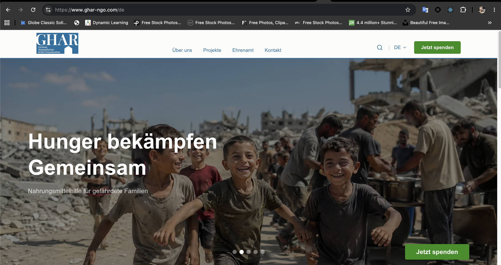
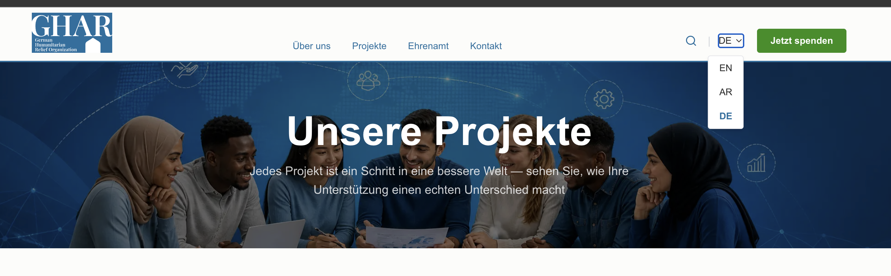
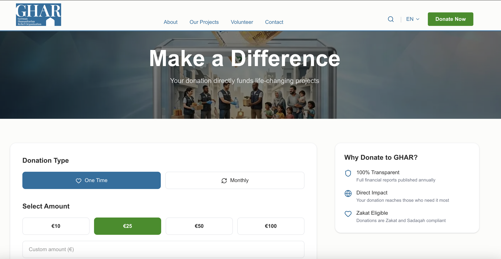
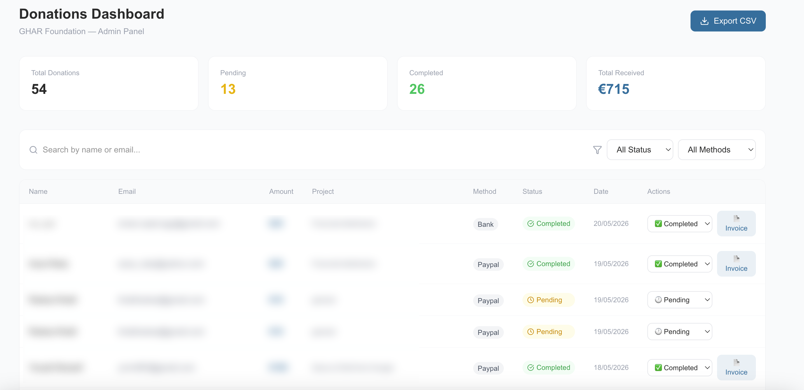

# GHAR Organization — Official Website

[](https://github.com/ibra8080/GHAR/commits/main)
[](https://github.com/ibra8080/GHAR/commits/main)
[](https://github.com/ibra8080/GHAR)

> **German Humanitarian Relief Organization e.V.**  
> Providing humanitarian aid to crisis-affected regions in Sudan and Yemen.

🌐 **Live:** [www.ghar-ngo.com](https://www.ghar-ngo.com)



---

## Table of Contents

- [GHAR Organization — Official Website](#ghar-organization--official-website)
  - [Table of Contents](#table-of-contents)
  - [Overview](#overview)
  - [Tech Stack](#tech-stack)
  - [Features](#features)
    - [Multilingual Support](#multilingual-support)
    - [CMS-Driven Content](#cms-driven-content)
    - [Donation System](#donation-system)
    - [Invoice System](#invoice-system)
    - [Admin Dashboard](#admin-dashboard)
    - [Project Progress Bars](#project-progress-bars)
    - [SEO \& GDPR](#seo--gdpr)
  - [Pages](#pages)
  - [Project Structure](#project-structure)
  - [Donation System](#donation-system-1)
    - [One-time PayPal](#one-time-paypal)
    - [Monthly Subscription](#monthly-subscription)
    - [Bank Transfer](#bank-transfer)
  - [Admin Dashboard](#admin-dashboard-1)
  - [Sanity CMS](#sanity-cms)
    - [Schemas (19 total)](#schemas-19-total)
  - [Environment Variables](#environment-variables)
  - [Local Development](#local-development)
    - [Prerequisites](#prerequisites)
    - [Setup](#setup)
    - [Available Scripts](#available-scripts)
  - [Deployment](#deployment)
    - [Domains](#domains)
    - [Vercel Setup](#vercel-setup)
    - [Sanity Webhook](#sanity-webhook)
    - [Supabase Keep-Alive](#supabase-keep-alive)
  - [Organization Info](#organization-info)
  - [License](#license)

---

## Overview

GHAR Foundation is a German-registered humanitarian NGO based in Bremen. This repository contains the full source code of the official website, including the public-facing multilingual website, CMS integration, donation infrastructure, and admin tooling.

The website targets two main audiences:
- **Arabic and Islamic communities** in Germany
- **German companies and institutions** seeking to support humanitarian projects

---

## Tech Stack

| Layer | Technology |
|-------|-----------|
| Frontend | Next.js 16 (App Router) |
| CMS | Sanity.io (19 schemas, embedded Studio at `/studio`) |
| Styling | Tailwind CSS (`@theme inline` syntax) |
| Database | Supabase (PostgreSQL) — Frankfurt region |
| Email | Resend (connected to `ghar-ngo.com`) |
| Payments | PayPal Business Live |
| i18n | next-intl — EN / AR (RTL) / DE |
| Hosting | Vercel (auto-deploy from `main`) |
| DNS | Cloudflare |

---

## Features

### Multilingual Support
Full EN / AR / DE support with automatic RTL layout for Arabic. Language switcher available on all pages.



### CMS-Driven Content
All content is managed via Sanity Studio (`/studio`). 19 schemas covering projects, news, team, partners, settings, and more.


### Donation System
- **One-time PayPal** — Manual admin confirmation flow
- **Monthly Subscriptions** — Fully automated via PayPal Webhook
- **Bank Transfer** — EPC QR Code + manual admin confirmation



### Invoice System
Auto-generated PDF invoices (DE/EN) sent via Resend — compliant with German law (Zuwendungsbestätigung).
- Steuernummer: 60/147/03398
- Vereinsregister: VR 8792 HB

### Admin Dashboard
Password-protected donor management panel with:
- Stats overview (total, pending, completed, received)
- Search, filter by status and payment method
- Status updates with invoice sending
- CSV export



### Project Progress Bars
Real-time donation tracking combining Supabase (completed donations) + Sanity (manual raised values).

### SEO & GDPR
- Metadata for all pages in EN / AR / DE
- OG Image for social sharing
- Cookie consent banner
- Privacy Policy + Impressum (§ 5 TMG compliant)

---

## Pages

| Page | Route | Description |
|------|-------|-------------|
| Home | `/` | Hero slider, projects, stats, latest news |
| About | `/about` | Story, mission, vision, values, team, partners |
| Projects | `/projects` | All projects with real-time progress bars |
| Project Detail | `/projects/[id]` | Project details + donation link |
| News | `/news` | Articles with pagination and year filter |
| News Detail | `/news/[id]` | Full article with Portable Text |
| Donate | `/donate` | PayPal + Bank Transfer + project-specific donations |
| Volunteer | `/volunteer` | Volunteer application form |
| Jobs | `/jobs` | Open positions list and detail pages |
| Contact | `/contact` | Contact form + Google Maps |
| Transparency | `/transparency` | Financial reports and governance |
| Privacy Policy | `/privacy` | EN / AR / DE |
| Impressum | `/impressum` | Legal information (§ 5 TMG) |
| Admin | `/admin/donations` | Password-protected donor dashboard |

---

## Project Structure

```
app/
├── [locale]/               → All public pages (EN/AR/DE)
│   ├── page.tsx            → Home
│   ├── about/              → About page
│   ├── projects/           → Projects list + detail
│   ├── news/               → News list + detail
│   ├── donate/             → Donation page
│   ├── volunteer/          → Volunteer page
│   ├── jobs/               → Jobs list + detail
│   ├── contact/            → Contact page
│   ├── transparency/       → Transparency page
│   ├── privacy/            → Privacy Policy
│   └── impressum/          → Impressum
├── admin/donations/        → Admin dashboard
├── api/
│   ├── paypal-webhook/     → PayPal subscription automation
│   ├── send-invoice/       → Resend invoice API
│   └── ping/               → Supabase keep-alive (Cron)
sanity/
├── schemaTypes/            → 19 Sanity schemas
└── lib/
    ├── queries.ts          → All GROQ queries
    └── client.ts           → Sanity client config
components/
└── layout/
    ├── Navbar.tsx          → Navigation + language switcher
    └── Footer.tsx          → Footer connected to Sanity siteSettings
lib/
├── generateInvoice.ts      → jsPDF invoice generator (DE/EN)
└── logoBase64.ts           → GHAR logo for PDF
messages/                   → EN / AR / DE translation files
proxy.ts                    → next-intl middleware (Next.js 16)
vercel.json                 → Cron job (daily Supabase ping)
```

---

## Donation System

### One-time PayPal
1. Donor fills in details → saved to Supabase with `status: pending`
2. Redirected to PayPal Donate Button
3. Admin manually updates status and sends invoice from dashboard

### Monthly Subscription
1. Donor fills in details → saved to Supabase with `status: pending`
2. PayPal Buttons SDK opens subscription window
3. **Automated** — PayPal Webhook updates status to `completed` and sends invoice PDF

### Bank Transfer
1. Donor fills in details → saved to Supabase with `status: pending`
2. Bank details + EPC QR Code displayed
3. Admin manually updates status and sends invoice

> **Note:** PayPal Donate Button does not emit Webhook events. Only Subscriptions are automated.

---

## Admin Dashboard

**URL:** `/admin/donations` (password protected)

Features:
- Total donations stats (total / pending / completed / received amount)
- Search by name or email
- Filter by status and payment method
- Update donation status
- Generate and send PDF invoice (DE/EN) via Resend
- Export all data as CSV

---

## Sanity CMS

**Studio URL:** `/studio`  
**Project ID:** `eg9gx04a` | **Dataset:** `ghar`

### Schemas (19 total)

| Schema | Type | Description |
|--------|------|-------------|
| `project` | Document | Humanitarian projects |
| `news` | Document | News articles + Portable Text |
| `teamMember` | Document | Team members |
| `partner` | Document | Partner organizations |
| `heroSlide` | Document | Home hero slides |
| `stat` | Document | Statistics |
| `job` | Document | Job listings |
| `siteSettings` | Singleton | Contact, social, bank details |
| `aboutContent` | Singleton | Story, mission, vision, values |
| `homeContent` | Singleton | Quote section |
| `transparencyContent` | Singleton | Transparency page content |
| `privacyContent` | Singleton | Privacy policy (EN/AR/DE) |
| `pageSettings` | Singleton | Design settings |
| `projectsPage` | Singleton | Projects page hero |
| `newsPage` | Singleton | News page hero |
| `jobsPage` | Singleton | Jobs page hero |
| `volunteerPage` | Singleton | Volunteer page hero |
| `donatePage` | Singleton | Donate page hero |
| `contactPage` | Singleton | Contact page hero |

---

## Environment Variables

```env
NEXT_PUBLIC_SANITY_PROJECT_ID=
NEXT_PUBLIC_SANITY_DATASET=
NEXT_PUBLIC_SUPABASE_URL=
NEXT_PUBLIC_SUPABASE_ANON_KEY=
SANITY_API_TOKEN=
RESEND_API_KEY=
NEXT_PUBLIC_PAYPAL_CLIENT_ID=
NEXT_PUBLIC_PAYPAL_PLAN_10=
NEXT_PUBLIC_PAYPAL_PLAN_25=
NEXT_PUBLIC_PAYPAL_PLAN_50=
NEXT_PUBLIC_PAYPAL_PLAN_100=
PAYPAL_CLIENT_ID=
PAYPAL_CLIENT_SECRET=
PAYPAL_WEBHOOK_ID=
PAYPAL_WEBHOOK_SECRET=
NEXT_PUBLIC_APP_URL=
NEXT_PUBLIC_ADMIN_PASSWORD=
```

---

## Local Development

### Prerequisites
- Node.js 18+
- npm

### Setup

```bash
# Clone the repository
git clone https://github.com/ibra8080/GHAR.git
cd GHAR

# Install dependencies
npm install

# Create environment file
cp .env.example .env.local
# Fill in your environment variables

# Run development server
npm run dev
```

Open [http://localhost:3000](http://localhost:3000) to view the site.

> **Note:** This project uses `legacy-peer-deps=true` in `.npmrc`

### Available Scripts

```bash
npm run dev      # Start development server
npm run build    # Build for production
npm run start    # Start production server
npm run lint     # Run ESLint
```

---

## Deployment

The site is deployed on [Vercel](https://vercel.com) with auto-deploy from the `main` branch.

### Domains

| Domain | Status |
|--------|--------|
| `www.ghar-ngo.com` | ✅ Primary (Vercel + Cloudflare) |
| `ghar-ngo.com` | ✅ Redirect → `www.ghar-ngo.com` |
| `ghar-ngo.de` | ✅ Redirect → `www.ghar-ngo.com` (301) |

### Vercel Setup

1. Connect your GitHub repository to Vercel
2. Add all environment variables in Vercel dashboard
3. Set production branch to `main`
4. Deploy

### Sanity Webhook

A webhook is configured in Sanity to trigger automatic Vercel redeployment on content changes.

### Supabase Keep-Alive

A daily Cron Job (configured in `vercel.json`) pings the Supabase instance to prevent free-tier sleep.

---

## Organization Info

| Field | Value |
|-------|-------|
| Name | German Humanitarian Relief Organization e.V. |
| Register | Amtsgericht Bremen — VR 8792 HB |
| Tax Number | 60/147/03398 |
| Address | Kullenkampffallee 193, 28217 Bremen |
| Email | info@ghar-ngo.com |
| Website | [www.ghar-ngo.com](https://www.ghar-ngo.com) |

---

## License

MIT — © 2026 GHAR Foundation — Developed by [Ibrahim Abusaif](https://github.com/ibra8080)